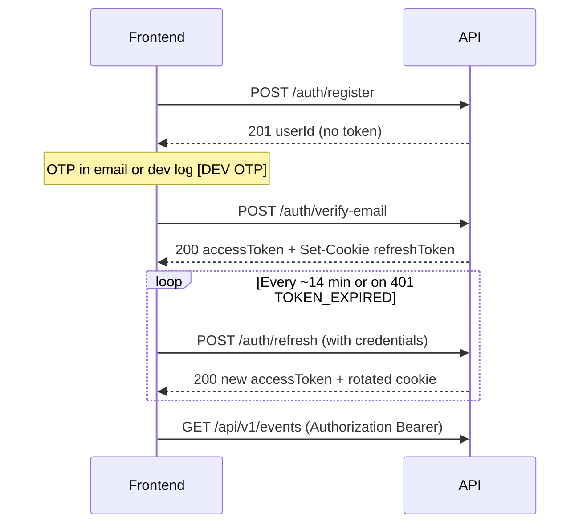

# InviteSheet API Reference

**Version:** 1.0 (MVP backend)  
**Last updated:** 2026-05-18  
**Audience:** Frontend developers integrating against the InviteSheet REST API and Socket.io layer.

This document follows common 2024/2025 API documentation practice: **single overview**, **auth workflow first**, **consistent envelopes**, **per-endpoint method/path/body/responses**, **realistic examples**, and **cross-cutting concerns** (errors, rate limits, WebSockets, env, local setup, Postman).

---

## Table of contents

1. [Overview & base URL](#1-overview--base-url)
2. [Authentication (JWT + refresh cookie)](#2-authentication-jwt--refresh-cookie)
3. [Response conventions](#3-response-conventions)
4. [Error format & status codes](#4-error-format--status-codes)
5. [Rate limiting](#5-rate-limiting)
6. [Roles & authorization](#6-roles--authorization)
7. [Plan limits](#7-plan-limits)
8. [Data models](#8-data-models)
9. [REST endpoints (42)](#9-rest-endpoints-42)
10. [WebSocket / Socket.io](#10-websocket--socketio)
11. [Cron jobs (server-side)](#11-cron-jobs-server-side)
12. [Environment variables](#12-environment-variables)
13. [Local setup](#13-local-setup)
14. [Postman collection](#14-postman-collection)
15. [Recommended frontend flows](#15-recommended-frontend-flows)

---

## 1. Overview & base URL


| Item                   | Value                                                        |
| ---------------------- | ------------------------------------------------------------ |
| **API prefix**         | `/api/v1`                                                    |
| **Local base URL**     | `http://localhost:4000`                                      |
| **Health (no prefix)** | `GET /health`, `GET /ready`                                  |
| **Content-Type**       | `application/json` for JSON bodies                           |
| **CORS**               | Configured via `CORS_ORIGINS`; `credentials: true` (cookies) |
| **Max JSON body**      | 10 KB (`express.json` limit)                                 |


### Success envelope (JSON routes)

```json
{
  "success": true,
  "data": { }
}
```

List routes also return:

```json
{
  "success": true,
  "data": [ ],
  "pagination": {
    "total": 100,
    "page": 1,
    "limit": 20,
    "totalPages": 5
  }
}
```

### Exceptions (no JSON envelope)


| Route                                | Response                                               |
| ------------------------------------ | ------------------------------------------------------ |
| `GET /api/v1/users/me/export`        | JSON file download (`Content-Disposition: attachment`) |
| `GET /api/v1/sheets/:sheetId/export` | Excel binary (`.xlsx`)                                 |


---

## 2. Authentication (JWT + refresh cookie)

### Access token (Bearer)

- Header: `Authorization: Bearer <accessToken>`
- JWT payload: `{ sub: userId, companyId, role }`
- Default expiry: `JWT_ACCESS_EXPIRES_IN` (default **15m**)
- Required on all `/api/v1/`* routes except **Auth** (except `POST /auth/logout` which requires Bearer).

### Refresh token (httpOnly cookie)


| Property    | Value                                        |
| ----------- | -------------------------------------------- |
| Cookie name | `refreshToken`                               |
| Path        | `/api/v1/auth/refresh`                       |
| httpOnly    | `true`                                       |
| sameSite    | `strict`                                     |
| secure      | `true` in production, `false` in development |
| Max age     | 7 days                                       |


Issued on: `POST /auth/verify-email`, `POST /auth/login`  
Rotated on: `POST /auth/refresh`  
Cleared on: `POST /auth/logout`, failed refresh reuse (all user sessions revoked)

### Auth flow (frontend)




### Fetch / axios notes

- Enable **credentials** for refresh: `fetch(url, { credentials: 'include' })` or `axios.defaults.withCredentials = true`
- Store `accessToken` in memory (preferred) or secure storage; attach to API calls
- On `401` + `TOKEN_EXPIRED`: call refresh once, retry original request; if refresh fails → login screen

### Socket.io auth

```javascript
import { io } from 'socket.io-client';

const socket = io('http://localhost:4000', {
  auth: { token: accessToken },
  withCredentials: true,
  transports: ['websocket', 'polling'],
});
```

---

## 3. Response conventions


| HTTP    | Meaning in this API                                                        |
| ------- | -------------------------------------------------------------------------- |
| **200** | OK (GET, PATCH, DELETE, most POST auth)                                    |
| **201** | Created (register, event, sheet, column, guest)                            |
| **400** | Validation / bad request                                                   |
| **401** | Missing/invalid/expired token, bad credentials, OTP issues, account locked |
| **403** | Forbidden (role, plan limit, locked column)                                |
| **404** | Resource not found (or invalid ObjectId treated as not found)              |
| **409** | Conflict (duplicate email, duplicate column name)                          |
| **429** | Rate limit (HTTP limiters or OTP resend cooldown)                          |
| **500** | Unhandled server error                                                     |
| **503** | `GET /ready` when MongoDB disconnected                                     |


**Note on 423:** RFC 4918 defines **423 Locked** for locked resources. **InviteSheet does not return HTTP 423.** Account lockout uses **401** with code `ACCOUNT_LOCKED`.

---

## 4. Error format & status codes

### Error envelope

```json
{
  "success": false,
  "error": {
    "code": "VALIDATION_ERROR",
    "message": "Validation failed",
    "fields": {
      "email": ["Invalid email"],
      "password": ["Password must contain at least one uppercase letter"]
    }
  }
}
```

`fields` is only present for validation errors when field-level messages exist.

### Error code reference


| Code                        | HTTP | When                                       |
| --------------------------- | ---- | ------------------------------------------ |
| `VALIDATION_ERROR`          | 400  | Zod / body / query validation              |
| `INVALID_REQUEST`           | 400  | Business rule (e.g. end date before start) |
| `INVALID_OTP`               | 400  | Wrong OTP                                  |
| `TOO_MANY_OTP_ATTEMPTS`     | 400  | OTP max attempts exceeded                  |
| `EMPTY_FILE`                | 400  | Import: no file                            |
| `MISSING_GUEST_NAME_COLUMN` | 400  | Import: required column                    |
| `INVALID_FILE_TYPE`         | 400  | Import: not xlsx/xls/csv                   |
| `FILE_TOO_LARGE`            | 400  | Import: > 5 MB                             |
| `UNAUTHORIZED`              | 401  | No/invalid Bearer, bad login               |
| `TOKEN_EXPIRED`             | 401  | JWT expired                                |
| `TOKEN_INVALID`             | 401  | JWT malformed                              |
| `OTP_EXPIRED`               | 401  | OTP missing/expired                        |
| `ACCOUNT_LOCKED`            | 401  | Too many failed logins                     |
| `REFRESH_TOKEN_INVALID`     | 401  | Refresh missing/invalid/reuse              |
| `FORBIDDEN`                 | 403  | Insufficient role                          |
| `COLUMN_LOCKED`             | 403  | Cannot rename/delete locked column         |
| `PLAN_LIMIT_REACHED`        | 403  | Free plan event/guest cap                  |
| `NOT_FOUND`                 | 404  | Entity not found                           |
| `CONFLICT`                  | 409  | Duplicate email / column name              |
| `RATE_LIMIT_EXCEEDED`       | 429  | OTP resend cooldown or HTTP rate limit     |
| `INTERNAL_ERROR`            | 500  | Unhandled exception                        |


Production `500` messages are generic: `"An unexpected error occurred"`.

---

## 5. Rate limiting

### HTTP (Express)


| Limiter    | Applies to       | Default                                                        | Response |
| ---------- | ---------------- | -------------------------------------------------------------- | -------- |
| **Global** | `/api/`*         | 100 req / 60s per IP                                           | 429      |
| **Auth**   | `/api/v1/auth/`* | 10 req / 60s per IP (failed attempts count; successes skipped) | 429      |


```json
{
  "success": false,
  "error": {
    "code": "RATE_LIMIT_EXCEEDED",
    "message": "Too many requests. Please slow down."
  }
}
```

### OTP resend cooldown

`POST /auth/resend-otp` → **429** if called again within **30 seconds** for same email/purpose.

### Socket.io (per connection)


| Event                   | Limit           |
| ----------------------- | --------------- |
| `client:cell_edit`      | 30 / 10 seconds |
| `client:toggle_checkin` | 20 / 5 seconds  |


Emits `server:error` with `RATE_LIMIT_EXCEEDED`.

---

## 6. Roles & authorization


| Role     | Level | Typical use                            |
| -------- | ----- | -------------------------------------- |
| `member` | 1     | View/edit guests, sheets               |
| `admin`  | 2     | Company settings, delete events/sheets |
| `owner`  | 3     | Delete account, all admin powers       |


`roleGuard('admin', 'owner')` means user must be **admin or owner** (minimum level = lowest of listed roles).


| Endpoint pattern                          | Guard        |
| ----------------------------------------- | ------------ |
| `DELETE /users/me`                        | owner only   |
| `PATCH /companies/me`                     | admin, owner |
| `DELETE /events/:eventId`                 | admin, owner |
| `DELETE /events/:eventId/sheets/:sheetId` | admin, owner |


---

## 7. Plan limits

Applies when `company.plan === 'free'`.


| Limit                           | Env var                 | Default | Enforced on                                 |
| ------------------------------- | ----------------------- | ------- | ------------------------------------------- |
| Events per company              | `FREE_PLAN_EVENT_LIMIT` | **2**   | `POST /events`                              |
| Guests per company (all sheets) | `FREE_PLAN_GUEST_LIMIT` | **200** | `POST .../guests`, `POST .../guests/import` |


**403 response:**

```json
{
  "success": false,
  "error": {
    "code": "PLAN_LIMIT_REACHED",
    "message": "You have reached the free plan limit of 2 events. Upgrade to Pro to create unlimited events."
  }
}
```

`pro` plan: no guest/event caps in code (limits not checked).

---

## 8. Data models

### User (public shape)

```typescript
interface PublicUser {
  _id: string;
  fullName: string;
  email: string;
  phone: string;           // stored as +91XXXXXXXXXX
  role: 'owner' | 'admin' | 'member';
  isEmailVerified: boolean;
  onboardingStep: number;  // 0–4
  createdAt?: string;      // ISO date
}
```

### Company (public shape)

```typescript
interface PublicCompany {
  _id: string;
  companyName: string;
  logoUrl: string | null;
  whatsappNumber: string | null;
  city: string | null;
  plan: 'free' | 'pro';
  eventsUsed: number;
  onboardingComplete: boolean;
}
```

### Event

```typescript
interface Event {
  _id: string;
  name: string;
  location: string;
  eventType: 'Wedding' | 'Corporate' | 'Social' | 'Other';
  startDate: string;       // ISO date from DB
  endDate: string;
  status: 'upcoming' | 'active' | 'past';  // computed
  defaultSheetId?: string;  // on create only
  sheetCount?: number;      // on list
  counters?: EventCounters; // on list
  sheets?: SheetSummary[];  // on getOne
}
```

### Sheet

```typescript
interface Sheet {
  _id: string;
  eventId: string;
  name: string;
  tabColor: string | null;
  position: number;
  columnDefinitions: ColumnDefinition[];
  guestCount?: number;
}

interface ColumnDefinition {
  _id: string;
  name: string;
  type: 'text' | 'number' | 'date' | 'dropdown' | 'checkin';
  isLocked: boolean;
  isMandatory: boolean;
  dropdownOptions: string[];
  width: number;
  order: number;
}
```

**Default sheet on event create:** name `"Guest List"`, locked columns: Guest Name, Contact Number, Check In, plus optional columns from create payload.

### Guest

```typescript
interface Guest {
  _id: string;
  sheetId: string;
  rowIndex: number;
  guestName: string;
  contactNumber: string;
  isCheckedIn: boolean;
  checkedInAt: string | null;
  guestStatus: string | null;
  idType: string | null;
  travelPlan: string | null;
  noOfPax: number | null;
  noOfKids: number | null;
  roomNumber: string | null;
  arrivalDate: string | null;
  departureDate: string | null;
  comments: string | null;
  data: Record<string, string | number | boolean | null>; // custom column values by columnId
}
```

### Guest counters

```typescript
interface GuestCounters {
  total: number;
  checkedIn: number;
  notArrived: number;
  notComing: number;
  idsPending: number;
  idsReceived: number;
  vip: number;
}
```

---

## 9. REST endpoints (42)

### 9.1 Health (2) — no auth

#### `GET /health`

**200**

```json
{ "status": "ok", "timestamp": "2026-05-18T06:30:50.471Z" }
```

---

#### `GET /ready`

**200** (MongoDB connected)

```json
{ "status": "ready" }
```

**503** (MongoDB down)

```json
{ "status": "unavailable" }
```

---

### 9.2 Auth (8) — `/api/v1/auth`

#### `POST /auth/register`


|                    |                                                                                                               |
| ------------------ | ------------------------------------------------------------------------------------------------------------- |
| **Auth**           | None                                                                                                          |
| **Body**           | `companyName`, `fullName`, `email`, `phone` (10-digit Indian `6–9` + 9 digits), `password`, `confirmPassword` |
| **Password rules** | ≥8 chars, 1 uppercase, 1 digit, 1 special char                                                                |


**201**

```json
{
  "success": true,
  "data": {
    "userId": "665f...",
    "email": "user@example.com",
    "message": "OTP sent to your email. Please verify to complete registration."
  }
}
```


| Error | Code                      |
| ----- | ------------------------- |
| 400   | `VALIDATION_ERROR`        |
| 409   | `CONFLICT` (email exists) |


---

#### `POST /auth/verify-email`


|            |                           |
| ---------- | ------------------------- |
| **Body**   | `email`, `otp` (6 digits) |
| **Cookie** | Sets `refreshToken`       |


**200**

```json
{
  "success": true,
  "data": {
    "accessToken": "eyJhbG...",
    "user": { /* PublicUser */ },
    "company": { /* PublicCompany */ }
  }
}
```


| Error | Code                                   |
| ----- | -------------------------------------- |
| 400   | `INVALID_OTP`, `TOO_MANY_OTP_ATTEMPTS` |
| 401   | `OTP_EXPIRED`                          |
| 404   | `NOT_FOUND` (company)                  |


---

#### `POST /auth/login`


|            |                     |
| ---------- | ------------------- |
| **Body**   | `email`, `password` |
| **Cookie** | Sets `refreshToken` |


**200** — same shape as verify-email (`accessToken`, `user`, `company`).


| Error | Code                             |
| ----- | -------------------------------- |
| 400   | `VALIDATION_ERROR`               |
| 401   | `UNAUTHORIZED`, `ACCOUNT_LOCKED` |
| 404   | `NOT_FOUND`                      |


---

#### `POST /auth/refresh`


|                 |                                                 |
| --------------- | ----------------------------------------------- |
| **Auth**        | Cookie `refreshToken` only (no Bearer required) |
| **Body**        | none                                            |
| **Credentials** | Required (`credentials: 'include'`)             |


**200**

```json
{
  "success": true,
  "data": { "accessToken": "eyJhbG..." }
}
```


| Error | Code                    |
| ----- | ----------------------- |
| 401   | `REFRESH_TOKEN_INVALID` |


---

#### `POST /auth/logout`


|            |                       |
| ---------- | --------------------- |
| **Auth**   | Bearer required       |
| **Cookie** | Clears `refreshToken` |


**200**

```json
{ "success": true, "data": { "message": "Logged out successfully." } }
```

---

#### `POST /auth/forgot-password`


|          |         |
| -------- | ------- |
| **Body** | `email` |


**200** (always generic — no email enumeration)

```json
{
  "success": true,
  "data": { "message": "If an account exists, a reset code has been sent." }
}
```

---

#### `POST /auth/reset-password`


|          |                                                  |
| -------- | ------------------------------------------------ |
| **Body** | `email`, `otp`, `newPassword`, `confirmPassword` |


**200**

```json
{ "success": true, "data": { "message": "Password reset successfully." } }
```


| Error | Code                                                       |
| ----- | ---------------------------------------------------------- |
| 400   | `VALIDATION_ERROR`, `INVALID_OTP`, `TOO_MANY_OTP_ATTEMPTS` |
| 401   | `OTP_EXPIRED`                                              |


---

#### `POST /auth/resend-otp`


|          |                                                           |
| -------- | --------------------------------------------------------- |
| **Body** | `email`, `purpose`: `"email_verify"` | `"password_reset"` |


**200**

```json
{ "success": true, "data": { "message": "OTP sent." } }
```


| Error | Code                                 |
| ----- | ------------------------------------ |
| 429   | `RATE_LIMIT_EXCEEDED` (30s cooldown) |


---

### 9.3 Users (6) — `/api/v1/users` — Bearer required

#### `GET /users/me`

**200** → `{ success: true, data: PublicUser }`  
**404** → `NOT_FOUND`

---

#### `PATCH /users/me`

**Body (all optional):** `fullName`, `phone`

**200** → updated `PublicUser`  
**400** → `VALIDATION_ERROR`

---

#### `PATCH /users/me/password`

**Body:** `currentPassword`, `newPassword`, `confirmPassword`

**200** → `{ message: "Password updated successfully." }`  
**401** → wrong current password

---

#### `PATCH /users/me/onboarding`

**Body:** `step` (integer 0–4)

**200** → `{ onboardingStep: number }`  
**400** → `INVALID_REQUEST` (cannot go backwards)

---

#### `DELETE /users/me`


|          |                                                      |
| -------- | ---------------------------------------------------- |
| **Role** | owner only                                           |
| **Body** | `confirmText`: must be exactly `"DELETE MY ACCOUNT"` |


**200** → soft-delete message  
**403** → `FORBIDDEN`

---

#### `GET /users/me/export`

**200** — JSON attachment (GDPR-style export), not standard envelope.

---

### 9.4 Companies (3) — `/api/v1/companies` — Bearer required

#### `GET /companies/me`

**200** → `PublicCompany`

---

#### `PATCH /companies/me`


|          |                                            |
| -------- | ------------------------------------------ |
| **Role** | admin, owner                               |
| **Body** | `companyName?`, `whatsappNumber?`, `city?` |


**200** → updated company

---

#### `GET /companies/me/stats`

**200**

```json
{
  "success": true,
  "data": {
    "totalEvents": 2,
    "activeEvents": 1,
    "totalGuestsManaged": 45,
    "whatsappMessagesSent": 0
  }
}
```

---

### 9.5 Events (5) — `/api/v1/events` — Bearer required

#### `POST /events`

**Body:**

```json
{
  "name": "Sharma Wedding",
  "location": "Mumbai",
  "eventType": "Wedding",
  "startDate": "2026-06-01",
  "endDate": "2026-06-03"
}
```

`startDate` / `endDate`: `YYYY-MM-DD`.

**201**

```json
{
  "success": true,
  "data": {
    "_id": "...",
    "name": "Sharma Wedding",
    "location": "Mumbai",
    "eventType": "Wedding",
    "startDate": "...",
    "endDate": "...",
    "status": "upcoming",
    "defaultSheetId": "..."
  }
}
```


| Error | Code                      |
| ----- | ------------------------- |
| 400   | `INVALID_REQUEST` (dates) |
| 403   | `PLAN_LIMIT_REACHED`      |
| 404   | `NOT_FOUND`               |


---

#### `GET /events`

**Query:** `status` = `active`  `past`  `upcoming`  `all` (default `all`), `page` (default 1), `limit` (default 20, max 100)

**200** → `data[]` with `sheetCount`, `counters`, `pagination`

---

#### `GET /events/:eventId`

**200** → event + `sheets[]` summaries  
**404** → `NOT_FOUND`

---

#### `PATCH /events/:eventId`

**Body:** partial create fields

**200** → updated event  
**400** → date validation

---

#### `DELETE /events/:eventId`


|            |              |
| ---------- | ------------ |
| **Role**   | admin, owner |
| **Effect** | Soft delete  |


**200** → `{ message: "Event deleted." }`

---

### 9.6 Sheets (5) — `/api/v1/events/:eventId/sheets` — Bearer required

#### `GET /events/:eventId/sheets`

**200** → `data: Sheet[]`

---

#### `POST /events/:eventId/sheets`

**Body:**

```json
{
  "name": "VIP Table",
  "tabColor": "#FF5733",
  "selectedColumns": ["noOfPax", "roomNumber", "guestStatus"]
}
```

`selectedColumns` optional enum: `noOfPax`, `noOfKids`, `roomNumber`, `travelPlan`, `idType`, `arrivalDate`, `departureDate`, `guestStatus`, `comments`.

**201** → new sheet

---

#### `PATCH /events/:eventId/sheets/reorder`

**Body:** `{ "sheetIds": ["id1", "id2"] }` — all IDs must belong to event

**200** → `{ message: "Sheets reordered." }`  
**400** → invalid sheet IDs

---

#### `PATCH /events/:eventId/sheets/:sheetId`

**Body:** `name?`, `tabColor?` (nullable)

**200** → updated sheet

---

#### `DELETE /events/:eventId/sheets/:sheetId`


|          |                                   |
| -------- | --------------------------------- |
| **Role** | admin, owner                      |
| **Rule** | Cannot delete last sheet on event |


**200** / **400** (last sheet) / **404**

---

### 9.7 Columns (4) — `/api/v1/sheets/:sheetId/columns` — Bearer required

Columns are **embedded** on the Sheet document (not a separate MongoDB collection).

#### `GET /sheets/:sheetId/columns`

**200** → `data: ColumnDefinition[]`

---

#### `POST /sheets/:sheetId/columns`

**Body:**

```json
{
  "name": "Meal Preference",
  "type": "dropdown",
  "dropdownOptions": ["Veg", "Non-Veg"]
}
```

`type`: `text`  `number`  `date`  `dropdown`  `checkin`  
`dropdownOptions` required when `type` is `dropdown`.

**201** → new column  
**409** → duplicate name

---

#### `PATCH /sheets/:sheetId/columns/:columnId`

**Body:** `name?`, `dropdownOptions?`, `width?` (50–800)

**200** / **403** `COLUMN_LOCKED` (locked columns) / **409**

---

#### `DELETE /sheets/:sheetId/columns/:columnId`

**200** / **403** (locked) / **404**

---

### 9.8 Guests (9) — `/api/v1/sheets/:sheetId/...` — Bearer required

#### `GET /sheets/:sheetId/guests/counters`

**200**

```json
{ "success": true, "data": { /* GuestCounters */ } }
```

---

#### `GET /sheets/:sheetId/guests`

**Query:** `page` (default 1), `limit` (default 100, max 500), `search?` (text index on guestName)

**200** → `data: Guest[]`, `pagination`

---

#### `POST /sheets/:sheetId/guests`

**Body:**

```json
{
  "guestName": "Rahul Sharma",
  "contactNumber": "9820123456",
  "guestStatus": "Confirmed",
  "noOfPax": 2,
  "noOfKids": 0,
  "roomNumber": "101",
  "comments": "VIP"
}
```

All fields except `guestName` optional.

**201** → guest (also emits Socket `server:row_added`)  
**403** → `PLAN_LIMIT_REACHED`

---

#### `POST /sheets/:sheetId/guests/import`


|                     |                                        |
| ------------------- | -------------------------------------- |
| **Content-Type**    | `multipart/form-data`                  |
| **Field**           | `file` (.xlsx, .xls, .csv, max 5 MB)   |
| **Required column** | Guest name column (see import service) |


**200**

```json
{
  "success": true,
  "data": {
    "imported": 10,
    "skipped": 2,
    "duplicates": 1,
    "existingDuplicates": 0
  }
}
```


| Error | Code                 |
| ----- | -------------------- |
| 400   | file errors, no file |
| 403   | plan limit           |


---

#### `GET /sheets/:sheetId/export`

**200** — Excel file download (not JSON).

---

#### `PATCH /sheets/:sheetId/guests/:guestId/checkin`

**Body:** `{ "isCheckedIn": true }`

**200** → updated guest (Socket: `server:checkin_updated`, `server:counters_updated`)

---

#### `PATCH /sheets/:sheetId/checkin/room`

**Body:** `{ "roomNumber": "101", "mode": "all" | "remaining" }`

**200** → `{ message: "Room check-in updated." }`

---

#### `PATCH /sheets/:sheetId/guests/:guestId`

**Body:** partial guest fields + `arrivalDate?`, `departureDate?`

**200** → updated guest

---

#### `DELETE /sheets/:sheetId/guests/:guestId`

**200** → soft delete (Socket: `server:row_deleted`)

---

## 10. WebSocket / Socket.io

Same origin as API: `http://localhost:4000`. Connect with **access JWT** in `handshake.auth.token`.

### Client → Server


| Event                   | Payload                     | Description                                           |
| ----------------------- | --------------------------- | ----------------------------------------------------- |
| `client:join_sheet`     | `{ sheetId: string }`       | Join room `sheet:{id}`; presence + sheet access       |
| `client:leave_sheet`    | `{ sheetId: string }`       | Leave room                                            |
| `client:cell_edit`      | `{ guestId, field, value }` | Update cell; `value` string | number | boolean | null |
| `client:toggle_checkin` | `{ guestId, isCheckedIn }`  | Toggle check-in                                       |


**Editable fields:** `guestName`, `contactNumber`, `guestStatus`, `idType`, `travelPlan`, `noOfPax`, `noOfKids`, `roomNumber`, `comments`, or custom column id in `data`.

### Server → Client


| Event                         | Payload                                     |
| ----------------------------- | ------------------------------------------- |
| `server:presence_joined`      | `{ userId, fullName, activeCount }`         |
| `server:presence_left`        | `{ userId, activeCount }`                   |
| `server:presence_list`        | `{ members: [{ userId, fullName }] }`       |
| `server:row_updated`          | `{ guestId, field, value, sourceSocketId }` |
| `server:row_added`            | `{ guest }`                                 |
| `server:row_deleted`          | `{ guestId }`                               |
| `server:checkin_updated`      | `{ guestId, isCheckedIn, checkedInAt }`     |
| `server:counters_updated`     | `{ counters: GuestCounters }`               |
| `server:column_added`         | `{ column }`                                |
| `server:column_updated`       | `{ column }`                                |
| `server:column_deleted`       | `{ columnId }`                              |
| `server:bulk_import_complete` | import summary                              |
| `server:error`                | `{ code, message }`                         |


Ignore `server:row_updated` when `sourceSocketId === socket.id` to avoid echo loops.

### Socket errors

Connection auth failure: middleware error `UNAUTHORIZED` / `TOKEN_INVALID`.

Runtime: `server:error` with codes `NOT_FOUND`, `VALIDATION_ERROR`, `RATE_LIMIT_EXCEEDED`, `INTERNAL_ERROR`.

---

## 11. Cron jobs (server-side)

Not callable from frontend. Documented for ops / debugging.


| Schedule            | Job                                                                                      |
| ------------------- | ---------------------------------------------------------------------------------------- |
| Every **5 minutes** | Delete OTP records older than **10 minutes**                                             |
| Daily **20:00 UTC** | Hard-delete soft-deleted Users, Companies, Events, Sheets, Guests older than **30 days** |


---

## 12. Environment variables

Copy `server/env_example.md` → `server/.env`.

### Required (API server)


| Variable             | Description                                 |
| -------------------- | ------------------------------------------- |
| `NODE_ENV`           | `development` | `production` | `test`       |
| `MONGODB_URI`        | MongoDB connection string                   |
| `JWT_ACCESS_SECRET`  | ≥ 32 characters                             |
| `JWT_REFRESH_SECRET` | ≥ 32 characters (different from access)     |
| `CLIENT_URL`         | Frontend URL (e.g. `http://localhost:3000`) |
| `CORS_ORIGINS`       | Comma-separated allowed origins             |
| `ENCRYPTION_KEY`     | Exactly 64 hex chars (field encryption)     |


### Common optional


| Variable                      | Default                                           |
| ----------------------------- | ------------------------------------------------- |
| `PORT`                        | `4000`                                            |
| `JWT_ACCESS_EXPIRES_IN`       | `15m`                                             |
| `JWT_REFRESH_EXPIRES_IN`      | `7d`                                              |
| `OTP_EXPIRES_IN_MINUTES`      | `10`                                              |
| `OTP_MAX_ATTEMPTS`            | `3`                                               |
| `LOGIN_MAX_ATTEMPTS`          | `5`                                               |
| `LOGIN_LOCK_DURATION_MINUTES` | `15`                                              |
| `RATE_LIMIT_GLOBAL_MAX`       | `100`                                             |
| `RATE_LIMIT_GLOBAL_WINDOW_MS` | `60000`                                           |
| `RATE_LIMIT_AUTH_MAX`         | `10`                                              |
| `RATE_LIMIT_AUTH_WINDOW_MS`   | `60000`                                           |
| `FREE_PLAN_EVENT_LIMIT`       | `2`                                               |
| `FREE_PLAN_GUEST_LIMIT`       | `200`                                             |
| `SOCKET_CORS_ORIGINS`         | falls back to `CORS_ORIGINS`                      |
| `SMTP_`* / `EMAIL_FROM`       | Email; if unset, OTP logged in dev as `[DEV OTP]` |


### Postman sync only (not runtime)

`POSTMAN_API_KEY`, `POSTMAN_WORKSPACE_ID` — see skill `.cursor/skills/invitesheet-postman/`.

---

## 13. Local setup

### Prerequisites

- Node.js 20+
- MongoDB Atlas or local MongoDB

### Steps

1. **Clone** and open `server/`:
  ```powershell
   cd server
   npm install
  ```
2. **Environment:**
  ```powershell
   copy env_example.md .env
   # Edit .env — set MONGODB_URI, JWT secrets (64+ char hex), ENCRYPTION_KEY (64 hex)
  ```
3. **Start API:**
  ```powershell
   npm run dev
  ```
   Expect: `MongoDB connected`, `InviteSheet API listening on port 4000`.
4. **Verify:**
  - [http://localhost:4000/health](http://localhost:4000/health)
  - [http://localhost:4000/ready](http://localhost:4000/ready)
5. **First API test:** Register → read OTP from terminal (`[DEV OTP]`) → verify-email → login.

### Windows + Atlas note

If `mongodb+srv` fails with `querySrv ECONNREFUSED`, the server sets public DNS in `src/config/db.ts`. Same fix may be needed for standalone scripts.

---

## 14. Postman collection


| File                                                  | Purpose                                                      |
| ----------------------------------------------------- | ------------------------------------------------------------ |
| `server/postman/InviteSheet.postman_collection.json`  | 8 folders, **42 requests**, sample bodies                    |
| `server/postman/InviteSheet.postman_environment.json` | Variables: `baseUrl`, `accessToken`, `eventId`, `sheetId`, … |


### Import (UI)

Postman → **Import** → select both JSON files → environment **InviteSheet Local**.

### Regenerate from code (after route changes)

```powershell
cd server
npm run postman:generate
```

### Push to Postman cloud (optional)

```powershell
$env:POSTMAN_API_KEY = "PMAK-..."
npm run postman:import
```

**Do not** use Postman MCP `createCollection` / `putCollection` for folder-based collections ([bug #142](https://github.com/postmanlabs/postman-mcp-server/issues/142)).

### Suggested run order

1. `01 — Health` → GET /health
2. `02 — Auth` → register → verify-email → login (saves `accessToken`)
3. `05 — Events` → POST /events (saves `eventId`, `sheetId`)
4. `08 — Guests` → POST guest, GET list, counters

---

## 15. Recommended frontend flows

### App bootstrap

1. If access token in memory → `GET /users/me`
2. On `401` / `TOKEN_EXPIRED` → `POST /auth/refresh` with credentials
3. Else → login / register screens

### RSVP sheet editor

1. `GET /events/:eventId` → sheets list
2. `GET /sheets/:sheetId/columns` + `GET /sheets/:sheetId/guests`
3. Connect Socket.io → `client:join_sheet`
4. Listen: `server:row_updated`, `server:counters_updated`, presence events
5. Optimistic UI for edits; reconcile from socket (skip own `sourceSocketId`)

### Create event wizard

1. `POST /events` → navigate to `defaultSheetId`
2. Optional: `POST /events/:eventId/sheets` for extra tabs

---

## Quick reference — all 42 endpoints


| #   | Method | Path                                              |
| --- | ------ | ------------------------------------------------- |
| 1   | GET    | `/health`                                         |
| 2   | GET    | `/ready`                                          |
| 3   | POST   | `/api/v1/auth/register`                           |
| 4   | POST   | `/api/v1/auth/verify-email`                       |
| 5   | POST   | `/api/v1/auth/login`                              |
| 6   | POST   | `/api/v1/auth/refresh`                            |
| 7   | POST   | `/api/v1/auth/logout`                             |
| 8   | POST   | `/api/v1/auth/forgot-password`                    |
| 9   | POST   | `/api/v1/auth/reset-password`                     |
| 10  | POST   | `/api/v1/auth/resend-otp`                         |
| 11  | GET    | `/api/v1/users/me`                                |
| 12  | PATCH  | `/api/v1/users/me`                                |
| 13  | PATCH  | `/api/v1/users/me/password`                       |
| 14  | PATCH  | `/api/v1/users/me/onboarding`                     |
| 15  | DELETE | `/api/v1/users/me`                                |
| 16  | GET    | `/api/v1/users/me/export`                         |
| 17  | GET    | `/api/v1/companies/me`                            |
| 18  | PATCH  | `/api/v1/companies/me`                            |
| 19  | GET    | `/api/v1/companies/me/stats`                      |
| 20  | POST   | `/api/v1/events`                                  |
| 21  | GET    | `/api/v1/events`                                  |
| 22  | GET    | `/api/v1/events/:eventId`                         |
| 23  | PATCH  | `/api/v1/events/:eventId`                         |
| 24  | DELETE | `/api/v1/events/:eventId`                         |
| 25  | GET    | `/api/v1/events/:eventId/sheets`                  |
| 26  | POST   | `/api/v1/events/:eventId/sheets`                  |
| 27  | PATCH  | `/api/v1/events/:eventId/sheets/reorder`          |
| 28  | PATCH  | `/api/v1/events/:eventId/sheets/:sheetId`         |
| 29  | DELETE | `/api/v1/events/:eventId/sheets/:sheetId`         |
| 30  | GET    | `/api/v1/sheets/:sheetId/columns`                 |
| 31  | POST   | `/api/v1/sheets/:sheetId/columns`                 |
| 32  | PATCH  | `/api/v1/sheets/:sheetId/columns/:columnId`       |
| 33  | DELETE | `/api/v1/sheets/:sheetId/columns/:columnId`       |
| 34  | GET    | `/api/v1/sheets/:sheetId/guests/counters`         |
| 35  | GET    | `/api/v1/sheets/:sheetId/guests`                  |
| 36  | POST   | `/api/v1/sheets/:sheetId/guests`                  |
| 37  | POST   | `/api/v1/sheets/:sheetId/guests/import`           |
| 38  | GET    | `/api/v1/sheets/:sheetId/export`                  |
| 39  | PATCH  | `/api/v1/sheets/:sheetId/guests/:guestId/checkin` |
| 40  | PATCH  | `/api/v1/sheets/:sheetId/checkin/room`            |
| 41  | PATCH  | `/api/v1/sheets/:sheetId/guests/:guestId`         |
| 42  | DELETE | `/api/v1/sheets/:sheetId/guests/:guestId`         |


---

**Support:** Backend repo `server/`. OpenAPI export is a possible follow-up; this document is the canonical MVP reference until then.